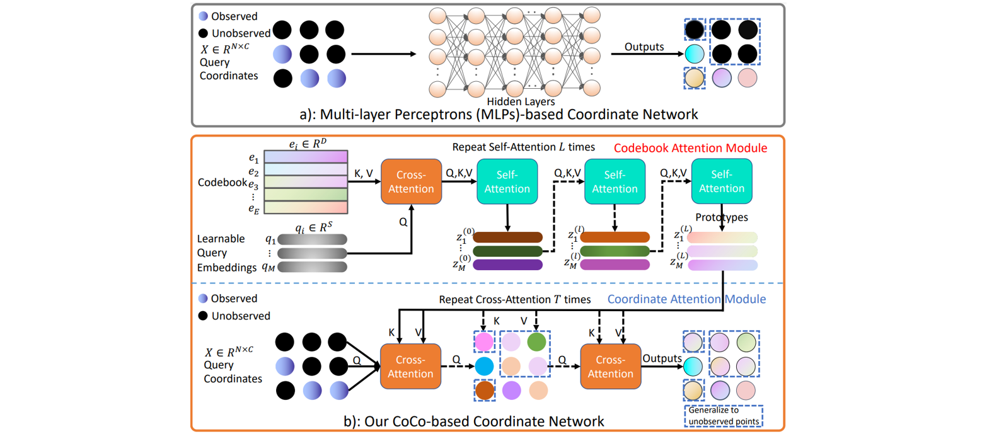

# CoCo-INR: Coordinates Are NOT Lonely  -- Codebook Prior Helps Implicit Neural 3D Representations <br><sub>Official PyTorch implementation </sub>

**CoCo-INR: Coordinates Are NOT Lonely  -- Codebook Prior Helps Implicit Neural 3D Representations (NeurIPS 2022, Spotlight)**

*[Fukun Yin](https://fukunyin.github.io/)\*, Wen Liu\*, Zilong Huang, Pei Cheng, Tao Chen†, Gang YU*

\* equal contribution

[Paper](https://arxiv.org/abs/2210.11170)



Implicit neural 3D representation has achieved impressive results in surface or scene reconstruction and novel view synthesis, which typically uses the coordinate-based multi-layer perceptrons (MLPs) to learn a continuous scene representation. However, existing approaches, such as Neural Radiance Field (NeRF) and its variants, usually require dense input views (i.e. 50-150) to obtain decent results. To relive the over-dependence on massive calibrated images and enrich the coordinate-based feature representation, we explore injecting the prior information into the coordinate-based network and introduce a novel coordinate-based model, CoCo-INR, for implicit neural 3D representation. The cores of our method are two attention modules: codebook attention and coordinate attention. The former extracts the useful prototypes containing rich geometry and appearance information from the prior codebook, and the latter propagates such prior information into each coordinate and enriches its feature representation for a scene or object surface. With the help of the prior information, our method can render 3D views with more photo-realistic appearance and geometries than the current methods using fewer calibrated images available. Experiments on various scene reconstruction datasets, including DTU and BlendedMVS, and the full 3D head reconstruction dataset, H3DS, demonstrate the robustness under fewer input views and fine detail-preserving capability of our proposed method.

## Installation

```shell

yum install ffmpeg or apt-get install ffmpeg

conda create -n coco_inr python=3.9.12

conda activate coco_inr

conda install pytorch==1.12.1 torchvision==0.13.1 cudatoolkit=10.2 -c pytorch

pip install -r requirements.txt

```

## Prepare Datasets and Codebooks

#### H3DS
* refer to https://github.com/CrisalixSA/h3ds

* extract the data, and move to `./data`

#### DTU
* refer to https://www.dropbox.com/sh/oum8dyo19jqdkwu/AAAxpIifYjjotz_fIRBj1Fyla
* download the `DTU.zip` and unzip it to `./data`

#### BlendMVS
* refer to https://www.dropbox.com/sh/oum8dyo19jqdkwu/AAAxpIifYjjotz_fIRBj1Fyla
* download the `BlendedMVS.zip` and unzip it to `./data`

#### New dataset

For more information on the data convention and how to run CoCo-INR on a new data please have a look at the preprocessing steps from VolSDF <a href="https://github.com/lioryariv/volsdf/blob/main/DATA_CONVENTION.md">data convention</a>.<br><br>

#### Codebook
* refer to https://compvis.github.io/taming-transformers

* pretrained codebook `./ckpts/model_16384x256_codebook.ckpt`


## Training

To run on the DTU dataset:
```
cd ./code
python training/exp_runner.py \
--conf ./confs/dtu.conf \
--expname dtu  \
--exps_folder /logs \
--scan_id SCAN_ID
```

To run on the BlendedMVS dataset:
```
cd ./code
python training/exp_runner.py \
--conf ./confs/bmvs.conf \
--expname bmvs  \
--exps_folder /logs \
--scan_id SCAN_ID
```

To run on the H3DS dataset:
```
cd ./code
python training/exp_runner.py \
--conf ./confs/h3ds.conf \
--expname h3ds  \
--exps_folder /logs \
--scan_id SCAN_ID
```

where SCAN_ID is the id of the scene.


## Inference
To produce the surface normals and renderings, run:

```
cd ./code
python evaluation/val_runner.py \
--conf ./confs/dtu.conf \
--expname dtu \
--checkpoint CHECKPOINT \
--exps_folder /logs \
--scan_id SCAN_ID
```
where CHECKPOINT is the epoch you wish to evaluate or 'latest' if you wish to take the most recent epoch.


## Citation

```latex
@inproceedings{yin2022cocoinr,
title={Coordinates Are NOT Lonely--Codebook Prior Helps Implicit Neural 3D Representations},
author={Yin, Fukun and Liu, Wen and Huang, Zilong and Cheng, Pei and Chen, Tao and YU, Gang},
booktitle={Advances in Neural Information Processing Systems (NeurIPS)},
year={2022}
}
```

